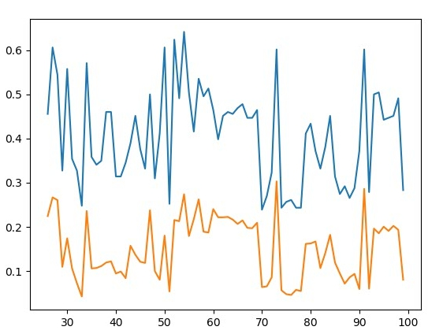

# Ngram2VecCategorization
Using naive bayes with ngrams after changing words to their cluster number, using kmean clusterization of word2vec to change each word to it cluster number.

Approach didn't give good results on large number of data. Results was close to received in news group for small numbers of category (4 category as in example http://scikit-learn.org/stable/tutorial/text_analytics/working_with_text_data.html) but after increasing number of clusters to whole newsgroup corpus, resulting accuracy dramatically lowered down.
Results can be seen in results25-100.jpg

On OY we can precision on guessing correct category and on OX - number of clusters.
Precision growing was expected after increasing number of clusters but it didn't help and result for 500 clusters was the same as on 100 clusters.